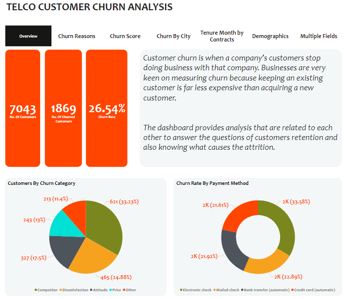
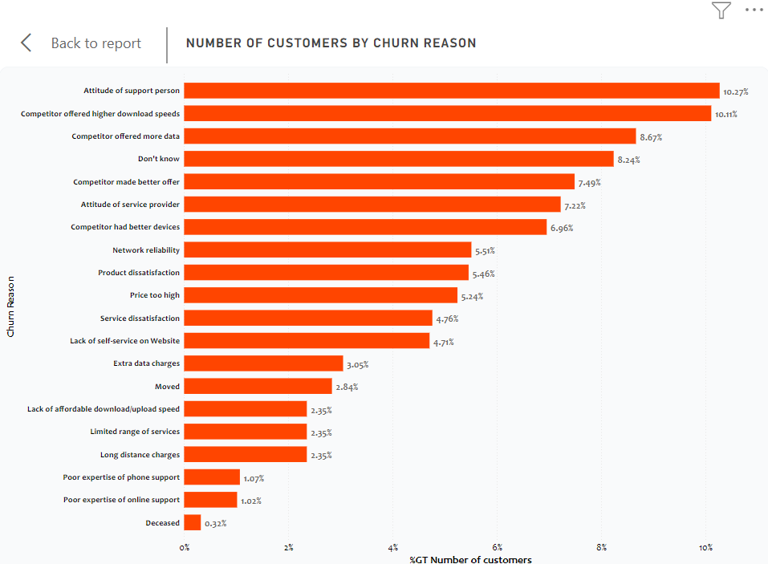
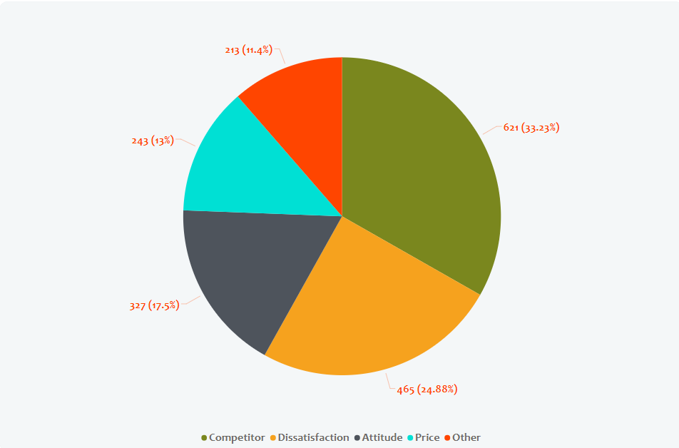
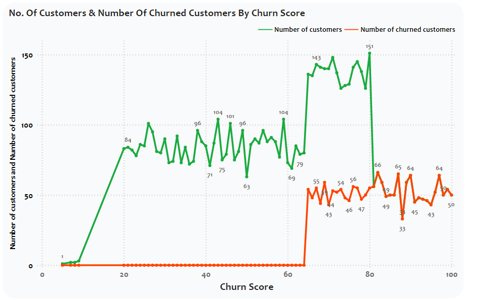
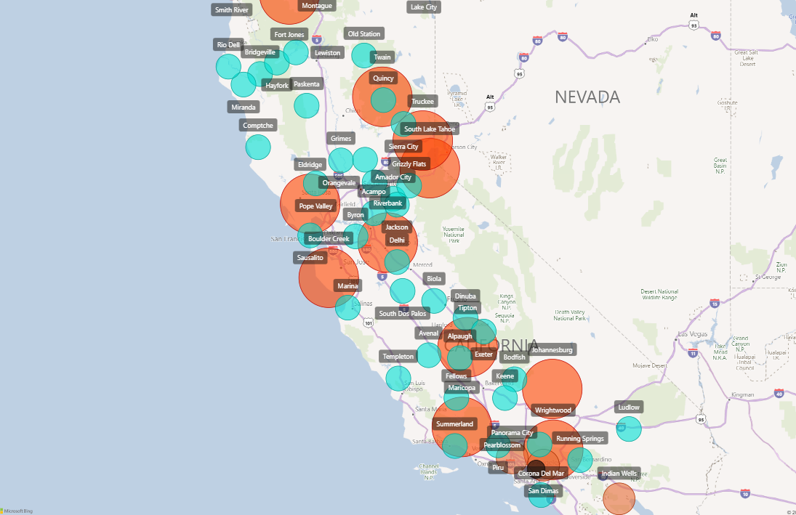
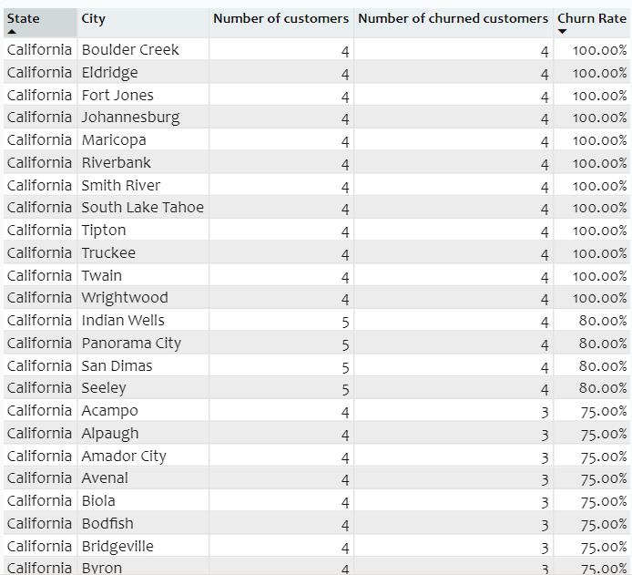

# Telco Customer Churn Analysis

## Introduction
This is a Power BI projects on **Telco Customer Churn Analysis** of a dummy dataset.In this documentation, we will explore a telco churn analysis, aiming to know why customer churn in a telecommunications company. By identifying customers who are likely to churn, the company can take proactive measures to retain them and improve customer satisfaction. The analysis will involve various stages, including data sourcing, data transformation, modeling, analysis and visualizations, and concluding with 
recommendations.

>_Disclaimer : All datasets and reports do not represent any 
company, institution or country, but just a dummy dataset to 
demonstrate capabilities with Power Bi._

---
## Problem Statmement
The problem we are addressing is the prediction of customer churn in a telecommunications company. Customer churn refers to the phenomenon of customers ending their relationship with a company or service. By predicting churn, the telco company can take appropriate actions to prevent customer attrition and minimize revenue loss. The goal is predicts which customers are likely to churn based on historical data analysed. This will be done by :

1.  Investigating Churn reasons and churn categories
2.  Investigating churn patterns by analyzing demographics, contract types    and payment method.
3.  Investigating churn score

---

## Skills/ Concepts demonstrated:
The following Power BI features were incorporated:
* Data Transformation
* Measures
* Power Query
* Tooltips
* Page Navigation
* Analysis & Visualization

---

## Modelling
No modelling was needed for the dataset

## Visualization

The report comprises of 7 pages:
 
 1. Overview
 2. Churn Reasons
 3. Churn City
 4. Churn Score
 5. Tenure Months By contracts
 6. Demographics
 7. Multiple Fields

You can interact with the report [here](https://app.powerbi.com/links/mAlNMsGhlq?ctid=e1e4f47f-4370-4de4-8a71-48984d434887&pbi_source=linkShare&bookmarkGuid=418d829d-33c9-4dc4-8a7b-b8ba2e3baa89)

---

### Features :

* The seven tabs are buttons with hovering effect and each navigates to the page with similar name.

## Analysis :
---
## Customer History :

The store currently have a total of 7043 customers. 1869 churned customers and the churn rate.
---
## Customer Reasons :

The highest churn reason is; "attitude of support persons", with 10.27% attrition rate followed by; "competitor offered higher download speeds".The reason for this analysis, is simply because , the best way to know how to stop churning, is to actually know the reasons for the attrition. If we dig deeper by categorising these reasons we will further get more insights concerning the reasons.
Now lets look at the categorised pie chart for churn category.
---
## Churn Category :

The competitor category for churn reasons has highest churn rate which is 33.23%, meaning 33.23% churn rate of customers are related to what the competitor offers, seconded by dissatisfaction of the telco services which is 24.88%.
Now we know where to look and focus efforts on.

---

## Churn Score

### Churn Score:
This is a value from 0-100 that is calculated using the predictive tool IBM SPSS Modeler. The model incorporates multiple factors known to cause churn.The higher the score, the more likely the customer will churn.

According to the line chart analysis, customers started churning when the churn score was 65, also we can see from the line chart at churn score 67, number of customers are
143 and number of churned customers are 55. 

Through this we can analyse customers that are likely to churn and provide a solution that will stop the potential attrition.

## Churn City

Adjusted model      			auto model
:-------------------: | :-------------------:
   |      
[table of images]

